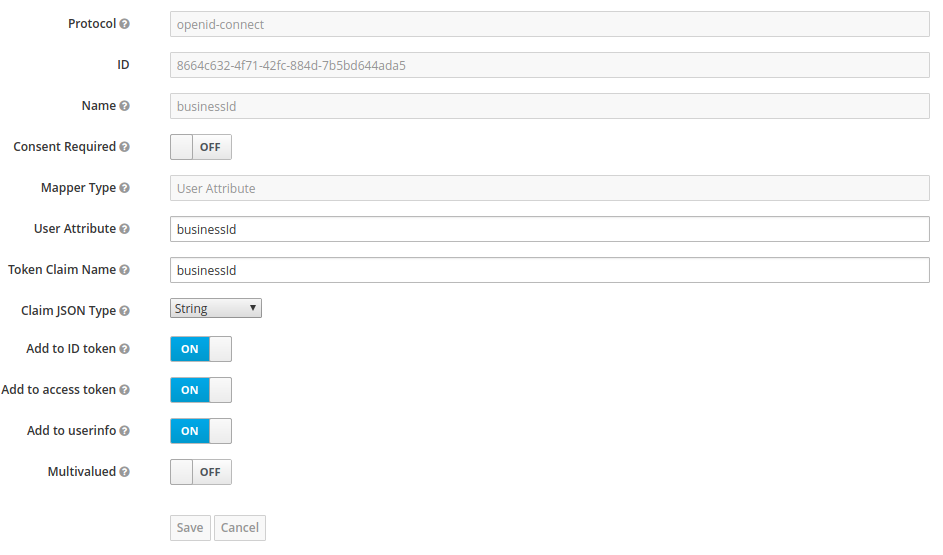

# UserManagement
User management microservice allows you to create, update and query users on the platform. This microservice uses Keycloak to manage the info of the users (User info, user state, roles, attributes) and control the access to the platform.

_This MicroService is built on top of NebulaE MicroService Framework.  Please see the [FrameWork project](https://github.com/NebulaEngineering/nebulae) to understand the full concept_**.


# Table of Contents
  * [Project Structure](#structure)
  * [FrontEnd](#frontend)
    *  [Environment variables](#frontend_env_vars)
  * [API](#api)
    * [GraphQL throught gateway API](#api_gateway_graphql)
  * [BackEnd](#backend)
    *  [user-management](#backend_user-management)
        * [Environment variables](#backend_user-management_env_vars)
        * [Event Sourcing](#backend_user-management_eventsourcing)
        * [CronJobs](#backend_user-management_cronjobs)
  * [General config](#general_config)
    * [Keycloak config](#keycloak_config)
    * [Create the initial user of a business](#first_user_business)        
  * [Development environment](#dev_env)
# Project structure <a name="structure"></a>

```
├── frontend                            => Micro-FrontEnd  
│   └── emi                             => Micro-FrontEnd for [emi FrontEnd](https://github.com/nebulae-tpm/emi)
├── api                                 => Micro-APIs  
│   └── emi-gateway                         => Micro-API for [emi-gateway API](https://github.com/nebulae-tpm/gateway)  
├── backend                             => Micro-BackEnds  
│   ├── user-management                 => Micro-BackEnd responsible for ...
├── etc                                 => Micro-Service config Files.  
├── deployment                          => Automatic deployment strategies  
│   ├── compose                         => Docker-Compose environment for local development  
│   └── gke                             => Google Kubernetes Engine deployment file descriptors  
│   └── mapi-setup.json                 => Micro-API setup file  
├── .circleci                           => CircleCI v2. config directory
│   ├── config.yml
│   └── scripts
├── docs                                => Documentation resources  
│   └── images  
├── README.md                           => This doc
```
# Frontend <a name="frontend"></a>

In the user management section you are going to be able to create, update, change password and assign roles to the users that belong to the same business of the logged in user. To enter to this section you have to have the "Business owner" role and belong to a business, otherwise you will not able to perform any of the operations previously mentioned.

Note: (An user cannot be deleted, only can be deactivated)

If you want to navigate to user management section, go to USERS > User management.


Once you enter to the section, you will see all of the users that were created on the platform and belong to the same business to which you belong.

This section has a filter in which you can search the users by username, first or last name, or email. 


If you click over an user of the table or click over the "Add user" button, you will redirect to a user form where you can create or update an user.

User form when click over the "Add user" button:


User form when click over an user of the table:


# API <a name="api"></a>
Exposed interfaces to send Commands and Queries by the CQRS principles.
The MicroService exposes its interfaces as Micro-APIs that are nested on the general API.

## GraphQL throught emi-gateway API <a name="api_gateway_graphql"></a>
These are the exposed GraphQL functions throught the [emi-gateway API](https://github.com/nebulae-tpm/gateway).  

Note: You may find the GraphQL schema [here](api/gateway/graphql/user-management/schema.gql)

### GraphQL Enums


### GraphQL types
* HelloWorld: Sample type, please remove
    * sn: String! => sample string
    
### GraphQL Queries
#### getHelloWorldFromuser-management
* Description : sample query, please remove
* returns : HelloWorld object.


### GraphQL Subscriptions

#### user-managementHelloWorldSubscription
* Description: sample subscription, please remove
* Data: HelloWorld object

### GraphQL Mutations
    N/A

# BackEnd <a name="backend"></a>
Backends are defined processes within a docker container.  
Each process is responsible to build, run and maintain itself.  

Each BackEnd has the following running commands:
  * npm start: executes main program
  * npm run get-ready: execute maintenance routines such DB indexes creation
  * npm run sync-state:  syncs backend state by reading all missing Events from the event-store
  * npm test: runs unit tests

## user-management <a name="backend_user-management"></a>
...


### Environment variables <a name="backend_user-management_env_vars"></a>


```
+------------------------------------------+--------+----------------------------------------------------------------------------------------------+-------+-----------+
|                 VARIABLE                 | TYPE   |                                          DESCRIPTION                                         |  DEF. | MANDATORY |
|                                          |        |                                                                                              | VALUE |           |
+------------------------------------------+--------+----------------------------------------------------------------------------------------------+-------+-----------+
| production                               | bool   | Production enviroment flag                                                                   | false |           |
+------------------------------------------+--------+----------------------------------------------------------------------------------------------+-------+-----------+
| EVENT_STORE_BROKER_TYPE                  | enum   | Event store broker type to use.                                                              |       |     X     |
|                                          | string | Ops: PUBSUB, MQTT                                                                            |       |           |
+------------------------------------------+--------+----------------------------------------------------------------------------------------------+-------+-----------+
| EVENT_STORE_BROKER_EVENTS_TOPIC          | enum   | Event store topic's name.                                                                    |       |     X     |
|                                          | string |                                                                                              |       |           |
+------------------------------------------+--------+----------------------------------------------------------------------------------------------+-------+-----------+
| EVENT_STORE_STORE_TYPE                   | enum   | Event store storage type to use.                                                             |       |     X     |
|                                          | string | Ops: MONGO                                                                                   |       |           |
+------------------------------------------+--------+----------------------------------------------------------------------------------------------+-------+-----------+
| EVENT_STORE_STORE_URL                    | string | Event store storage URL or connection string.                                                |       |     X     |
|                                          |        | Eg.: mongodb://127.0.0.1:27017/test                                                          |       |           |
+------------------------------------------+--------+----------------------------------------------------------------------------------------------+-------+-----------+
| EVENT_STORE_STORE_AGGREGATES_DB_NAME     | string | Event store storage database name for Aggregates                                             |       |     X     |
|                                          |        | Eg.: Aggregates                                                                              |       |           |
+------------------------------------------+--------+----------------------------------------------------------------------------------------------+-------+-----------+
| EVENT_STORE_STORE_EVENTSTORE_DB_NAME     | string | Event store storage database name prefix for Event Sourcing Events                           |       |     X     |
|                                          |        | Eg.: EventStore                                                                              |       |           |
+------------------------------------------+--------+----------------------------------------------------------------------------------------------+-------+-----------+
| GOOGLE_APPLICATION_CREDENTIALS           | string | Production only.                                                                             |       |     X     |
|                                          |        | Google service account key path to access google cloud resources.                            |       |           |
|                                          |        |                                                                                              |       |           |
|                                          |        | Eg.: /etc/GOOGLE_APPLICATION_CREDENTIALS/gcloud-service-key.json                             |       |           |
+------------------------------------------+--------+----------------------------------------------------------------------------------------------+-------+-----------+
| LOCKVERSION                              | string | Production only.                                                                             |       |     X     |
|                                          |        | word or phrase used to evaluate if the sync task should be run before starting this backend. |       |           |
|                                          |        | This value must be changed to force state sync task.                                         |       |           |
+------------------------------------------+--------+----------------------------------------------------------------------------------------------+-------+-----------+
| MONGODB_URL                              | string | Materialized views MONGO DB URL                                                              |       |     X     |
|                                          |        | Eg.: mongodb://127.0.0.1:27017/test                                                          |       |           |
+------------------------------------------+--------+----------------------------------------------------------------------------------------------+-------+-----------+
| MONGODB_DB_NAME                          | string | Materialized views MONGO DB name                                                             |       |     X     |
|                                          |        | Eg.: DeviceAlarmReports                                                                  |       |           |
+------------------------------------------+--------+----------------------------------------------------------------------------------------------+-------+-----------+
| JWT_PUBLIC_KEY                           | string | RSA Public key to verify JWT Tokens.                                                         |       |     X     |
|                                          |        | Format: -----BEGIN PUBLIC KEY-----\nPUBLIC_KEY\n-----END PUBLIC KEY-----                     |       |           |
+------------------------------------------+--------+----------------------------------------------------------------------------------------------+-------+-----------+
| REPLY_TIMEOUT                            | number | TimeOut in milliseconds in case of sending data through the broker and waiting the response. |  2000 |           |
+------------------------------------------+--------+----------------------------------------------------------------------------------------------+-------+-----------+
| BROKER_TYPE                              | enum   | Broker type to use for inter-process communication.                                          |       |     X     |
|                                          | string | Ops: PUBSUB, MQTT                                                                            |       |           |
+------------------------------------------+--------+----------------------------------------------------------------------------------------------+-------+-----------+
| KEYCLOAK_BACKEND_BASE_URL                | enum   | Keycloak URL or connection string.                                                           |       |     X     |
|                                          | string | Eg.: http://127.0.0.1:8080/auth                                                              |       |           |
+------------------------------------------+--------+----------------------------------------------------------------------------------------------+-------+-----------+
| KEYCLOAK_BACKEND_USER                    | enum   | Keycloak user.                                                                               |       |     X     |
|                                          | string | Eg.: admin                                                                                   |       |           |
+------------------------------------------+--------+----------------------------------------------------------------------------------------------+-------+-----------+
| KEYCLOAK_BACKEND_PASSWORD                | enum   | Keycloak password                                                                            |       |     X     |
|                                          | string | Eg.: password                                                                                |       |           |
+------------------------------------------+--------+----------------------------------------------------------------------------------------------+-------+-----------+
| KEYCLOAK_BACKEND_BASE_URL                | enum   | Keycloak URL or connection string.                                                           |       |     X     |
|                                          | string | Eg.: http://127.0.0.1:8080/auth                                                              |       |           |
+------------------------------------------+--------+----------------------------------------------------------------------------------------------+-------+-----------+
| KEYCLOAK_BACKEND_BASE_URL                | enum   | Keycloak URL or connection string.                                                           |       |     X     |
|                                          | string | Eg.: http://127.0.0.1:8080/auth                                                              |       |           |
+------------------------------------------+--------+----------------------------------------------------------------------------------------------+-------+-----------+

```


KEYCLOAK_BACKEND_BASE_URL= http://127.0.0.1:8080/auth
#### Notes: 
  * ENV VARS for development are [here](backend/user-management/.env)
  * ENV VARS for production are [here](deployment/gke/deployment-user-management.yaml)

### Event Sourcing <a name="backend_user-management_eventsourcing"></a>
    Event sourcing events this Micro-BackEnd is subscribed to or is publishing.
#### Subscribed events:    
*   EventType: what for ...

#### Published events: 
*   EventType: what for ...

### CronJobs <a name="backend_user-management_cronjobs"></a>
Time-based jobs that are configured and triggered by the [CronJob MicroService](https://github.com/nebulae-tpm/ms-cronjob)

# General Config <a name="general_config"></a>

## Keycloak config <a name="keycloak_config"></a>

To be able to perform all of the operations that the user management microservice provides, you have to do some configurations on Keycloak.

1. Create "BUSINESS-OWNER" role.


2. Create a new token mapper (token mapper name: businessId) to the client of the platform, this new mapper should be configured as indicated on the picture:



With this configuration, when an user logging in the platform, the token will contain the business ID to which the logged in user belongs (in case that this has been configured). This is useful to identify the business of the user logged in and so recover the users that belong to the same business, due that we cannot show users from other businesses.

## Create the initial user of a business <a name="first_user_business"></a>

The first user of a business has to be create manually through Keycloak

1. Create and configure the information of the user on Keycloak. 

2. Set a password to the user.

3. Associate the "BUSINESS-OWNER" to the user.


4. Add the "businessId" attribute to the user according to the business to which he belongs:


5. Once you did all of the steps, the user will be able to manage all of the users of its business.


# Development environment <a name="dev_env"></a>

## Install requeriments
* [node](https://nodejs.org/en/)
* [docker](https://docs.docker.com/install/)
* [docker-compose](https://docs.docker.com/compose/install/)
* [nodemon](https://www.npmjs.com/package/nodemon) 
   ```npm install -g nodemon```
* [Nebulae CLI](https://www.npmjs.com/package/@nebulae/cli)  
  ```npm install -g @nebulae/cli```  

## Prepare environment


### 1. clone this repo  
   ```git clone https://github.com/nebulae-tpm/ms-user-management.git```  
   
### 2. start databases, broker and security systems using docker-compose
```
cd deployment/compose/
docker-compose up
```
### 3. setup keycloak

#### LogIn to KeyCloak Admin Console
*  Navigate to http://localhost:8080/auth/admin/
*  user: keycloak
*  pass: keycloak  
    
#### Import Development realm: 
*  click on 'add realm' on the left panel
*  Select import option
*  import the file located at docs/resources/keycloakRealmToImport.json
  
#### Create the initial user:
* select the DEV_tpm keycloak realm and click on the users option from the left panel.
* select 'add user' option , fill the needed fields and enable the 'Email Verified' option.
* set a password by editing the user, open the 'credentials' tabs, type a new password and deselect the 'Temporary' option


Add the **developer** and **operator** rol to your user:
* select user option in the left panel and click on your user id.
* select the 'role mapping' tab
* select **developer** and **operator** options from available roles and click on add selected

### 4. Create PlayGround folder
   PlayGround is a directory where we are going to place the FrontEnd and API shells so the developer can run tests
   ```
   cd  REPO_DIRECTORY
   mkdir playgorund   
   ```

### 5. Compose FrontEnd
```
nebulae compose-ui development --shell-type=FUSE2_ANGULAR --shell-repo=https://github.com/nebulae-tpm/emi --frontend-id=emi --output-dir=/FULL_PATH_TO_REPO/ms-user-management/playground/emi  --setup-file=/FULL_PATH_TO_REPO/ms-user-management/etc/mfe-setup.json
```

### 6. Compose the API emi-gateway
```
nebulae compose-api development --api-type=NEBULAE_GATEWAY --api-repo=https://github.com/nebulae-tpm/emi-gateway --api-id=emi-gateway --output-dir=FULL_PATH_TO_REPO/ms-user-management/playground/emi-gateway  --setup-file=FULL_PATH_TO_REPO/ms-user-management/etc/emi-mapi-setup.json
```

### 7. Set the JWT token 
* LogIn to keycloak http://localhost:8080/auth/admin/ (user: "keycloak", pass: "keycloak")
* select the DEV_tpm keycloak realm and click on 'realm settings' in left panel
* select keys option tab
* click on 'public key' from the RSA key and copy the contents.
* set this key value to the **JWT_PUBLIC_KEY** atribute in the following files: *WORKING_FOLDER*/ms-user-management/backend/user-management/.env   *WORKING_FOLDER*/ms-user-management/playground/emi-gateway/.env  
Note: use the following format: ```JWT_PUBLIC_KEY=-----BEGIN PUBLIC KEY-----\nPUT_HERE_JWT_PUBLIC_KEY_VALUE\n-----END PUBLIC KEY-----```
* Setup the Apollo engine key to trace API requests
    * create a key at https://engine.apollographql.com/ and set it to the **APOLLO_ENGINE_API_KEY** atribute in the playground/emi-gateway/.env file

### 8. Remove FrontEnd base href used on production
change ```<base href="/emi/">``` to ```<base href="/">``` in the index.html located at playground/emi/src/index.html


## Start the development environment
1. Start the persistence layer, the broker and keycloak
```
cd deployment/compose/
docker-compose up
```
1. Start the Micro-BackEnd
```
cd backend/user-management/
npm install
npm start
```
3. Start the API emi-gateway
```
cd playground/emi-gateway
npm run start-dev-env
```
4. Start the FrontEnd
```
cd playground/emi
npm run start-dev-env
```

Finally navigate to http://localhost:4200/